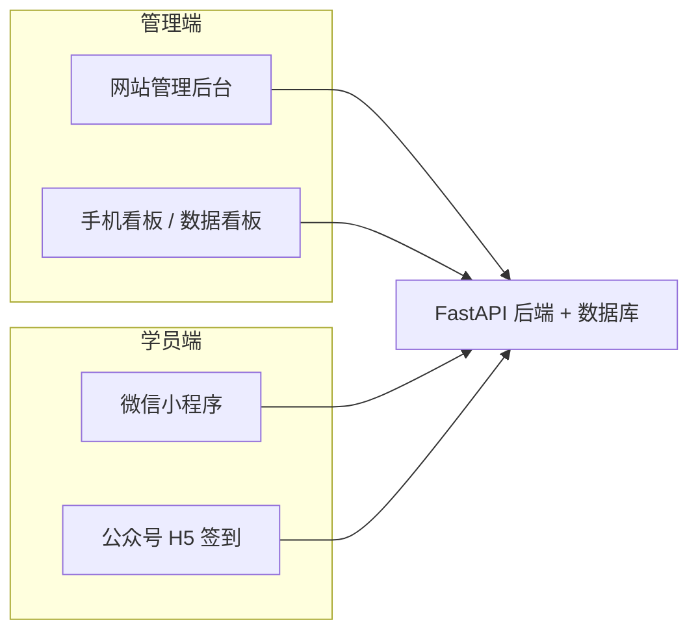
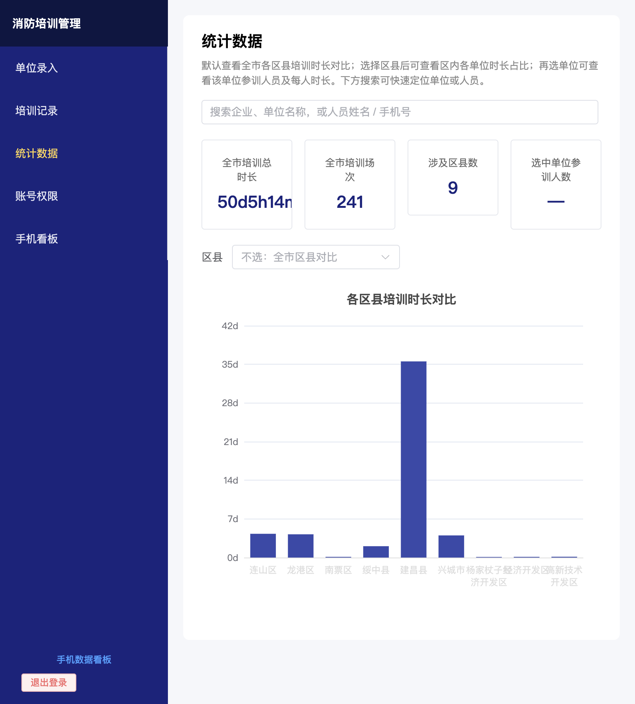
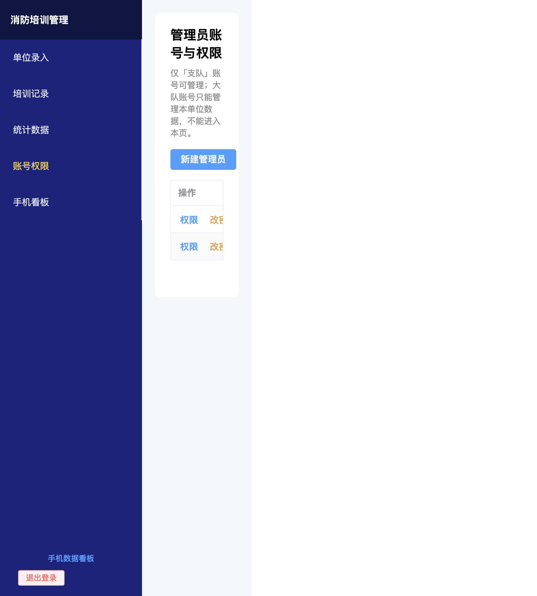
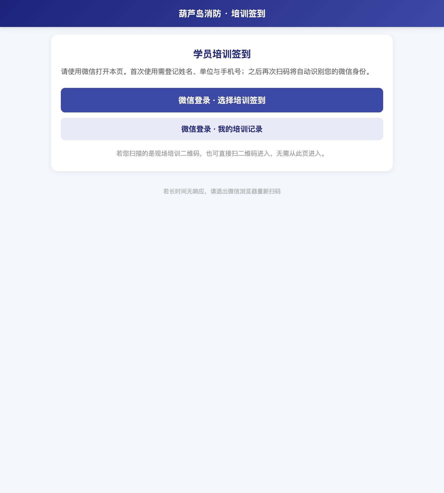
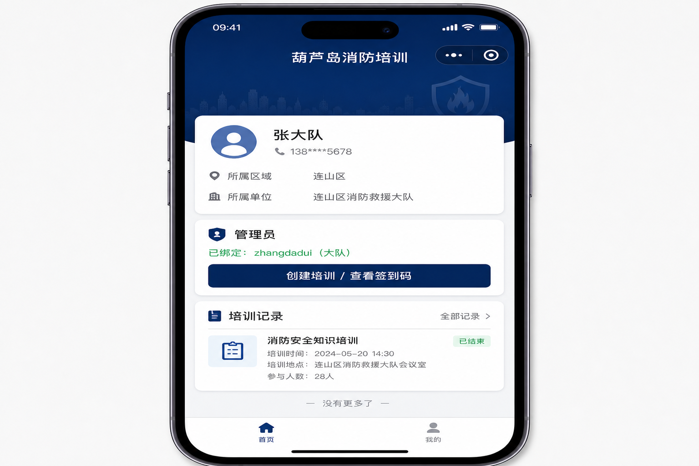
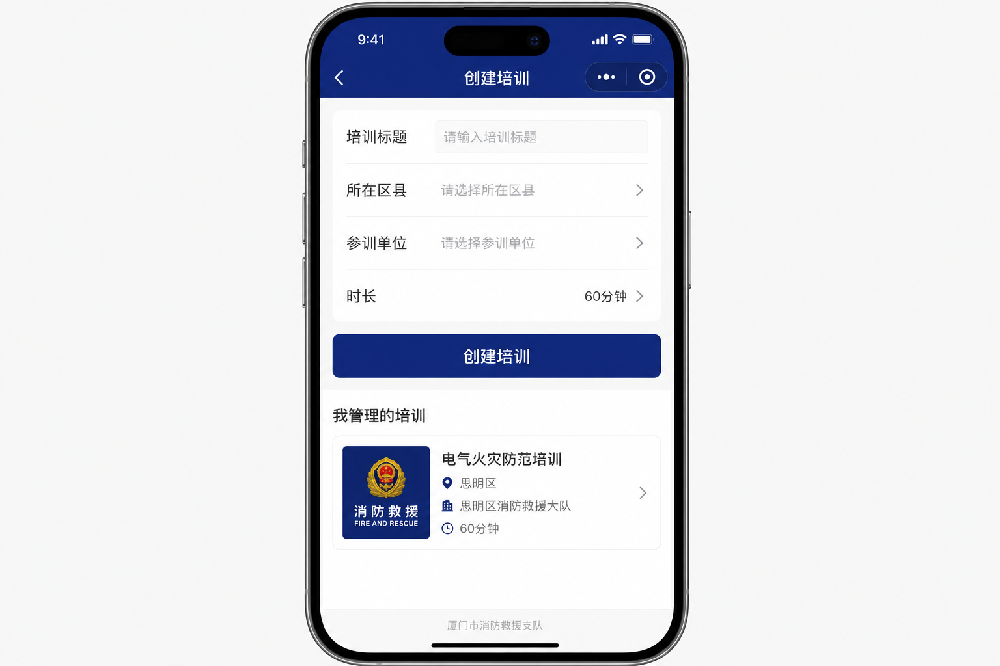
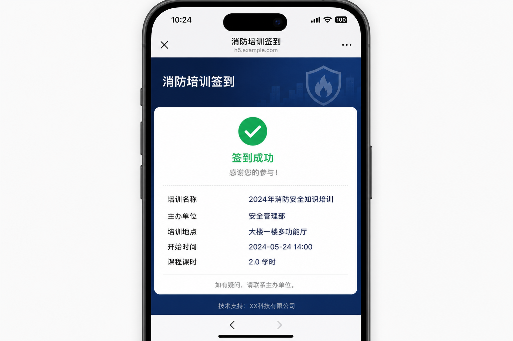

# 葫芦岛市消防救援支队 — 培训实名制系统

## 功能定位

本系统面向葫芦岛市消防救援支队及下属大队，对**行业部门、重点企业**的消防培训实行**实名制登记、现场扫码签到、分级统计汇总**，把原先分散在表格、纸质签到里的培训记录，统一到一套可查询、可对比、可追责的数字化平台。

**建设目的：** 落实培训「谁组织、谁参训、训多久」可查可证，为支队掌握全市培训覆盖面与学时提供数据支撑。

**解决的核心问题：**

| 痛点 | 系统做法 |
|------|----------|
| 参训人员身份不清、代签普遍 | 微信实名绑定（姓名、手机、区县、单位），签到与 openid 关联 |
| 培训记录分散、汇总困难 | 后台统一建场次、记签到，按区县 / 单位 / 个人自动汇总时长 |
| 现场组织繁琐、二维码难管理 | 管理员一键建培训并生成签到链接；培训结束自动关闭签到 |
| 支队与大队权限不清 | 支队看全市，大队仅本大队数据；账号分级管理 |
| 管理员只能坐办公室操作 | 网站发绑定码 + 小程序现场建培训（方式 B），微信即身份 |

---

## 系统架构（三端一体）

- **网站管理后台（PC）**：单位档案、培训记录、统计图表、支队账号与小程序绑定码管理。
- **手机看板 / H5**：浏览器访问的数据看板、公众号内培训签到与学员入口。
- **微信小程序**：学员实名登记、个人培训记录；管理员绑定后现场创建培训、复制签到链接。
- **统一后端**：鉴权、培训场次、签到记录、权限过滤、培训到期自动关闭。

---

## 主要功能模块

### 1. 单位与人员基础数据

- 按**大队 → 区县 → 单位（行业部门 / 企业）**维护参训单位名录。
- 支持检索、新增、编辑；为培训建档和统计提供主数据。

### 2. 培训场次管理

- 创建培训：标题、参训单位、开始时间、时长、地点、是否开放扫码。
- **超过结束时间自动关闭签到**，避免事后补签。
- 支持「一键快速建培训」并生成**本场签到二维码 / 链接**（公众号 OAuth）。

### 3. 实名制签到（公众号 H5）

- 学员用微信打开签到页：首次完成**姓名 + 手机 + 区县 + 单位**绑定。
- 扫**本场培训码**直接签到；或从通用入口登录后**选择当前开放场次**签到。
- 签到成功展示培训信息与本人单位，可查看「我的培训记录」。

### 4. 微信小程序（学员 + 管理员）

**学员：**

- 微信登录 → 实名资料 → 查看个人参训记录。

**管理员（方式 B）：**

1. 支队在网站「管理员账号」为大队账号**生成 6 位绑定码**（15 分钟有效）；
2. 管理员在小程序输入绑定码，将**网站账号与微信 openid** 关联；
3. 在小程序**创建培训**、复制签到链接，现场组织扫码签到。

> 网站仍使用账号密码登录；小程序不承担改密、权限分配，仅承担现场组织与身份绑定。

### 5. 统计与手机看板

- **全市 / 区县 / 单位 / 个人**多级培训时长统计与图表对比。
- 支持按单位名、人员姓名、手机号快速检索。
- 手机浏览器登录可进入**数据看板**（培训总时长、场次、区县对比等），便于领导现场查看。

### 6. 权限与安全

- **支队账号**：全市数据、管理下级管理员、生成小程序绑定码。
- **大队账号**：仅本大队单位与培训数据。
- 管理员微信绑定**一对一**；解绑须支队在网站操作。

---

## 典型业务场景

### 场景 A：大队组织一场现场培训

1. 大队管理员在**小程序**填写标题、区县、单位、时长 → 创建培训；
2. 将签到链接发到微信群或打印二维码；
3. 参训人员微信扫码 → H5 实名签到；
4. 支队 / 大队在网站**统计数据**查看本区县、本单位参训情况。

### 场景 B：支队掌握全市培训面

1. 各单位信息录入网站；
2. 各场次签到数据实时入库；
3. 打开「统计数据」查看各区县培训时长柱状对比、下钻到单位与个人。

### 场景 C：新大队管理员上岗

1. 支队在网站创建大队账号；
2. 生成绑定码，管理员小程序绑定；
3. 之后即可用手机创建培训，无需在现场使用 PC。

---

## 实机 / 界面演示

以下含**本机运行系统的真实 Web 截图**与**小程序 / H5 界面示意**（小程序需在真机或微信开发者工具中查看，示意图为功能说明用）。

### 网站 — 统计数据（本机实机截图）

全市培训总时长、场次、区县对比图；可下钻到单位与个人。（图中建昌县柱较高，来自测试批量数据。）

### 网站 — 管理员账号与小程序绑定（实机截图）

支队生成 6 位绑定码、查看绑定状态、解除绑定。

### 公众号 H5 — 学员签到入口（本机实机截图，手机宽度）

微信内打开，学员登录后选择场次签到或查看记录。

### 微信小程序 — 个人中心（界面示意）

实名信息、管理员绑定入口、个人培训记录。

### 微信小程序 — 管理员创建培训（界面示意）

绑定后现场建培训、复制签到链接。

### 公众号 H5 — 签到成功（界面示意）

扫码签到后的结果页。

---

## 部署与使用说明（摘要）

| 组件 | 说明 |
|------|------|
| 后端 | FastAPI，默认 `127.0.0.1:18080`，生产建议 systemd + Nginx 反代 |
| 网站 | Vue 构建静态资源，Nginx 托管 |
| 小程序 | 配置 `apiBase`、微信公众平台 request 合法域名、AppID/Secret |
| 公众号 H5 | 配置 `WECHAT_OA_*` 与网页授权域名 |

---

## 总结

本系统把**组织培训、实名签到、分级统计、移动管理**串成闭环：支队可量化全市培训成效，大队可在现场用手机完成建课与签到组织，学员用微信一次绑定、多次扫码，减轻造假与汇总成本，为消防培训实名制监管提供可落地的信息化工具。
